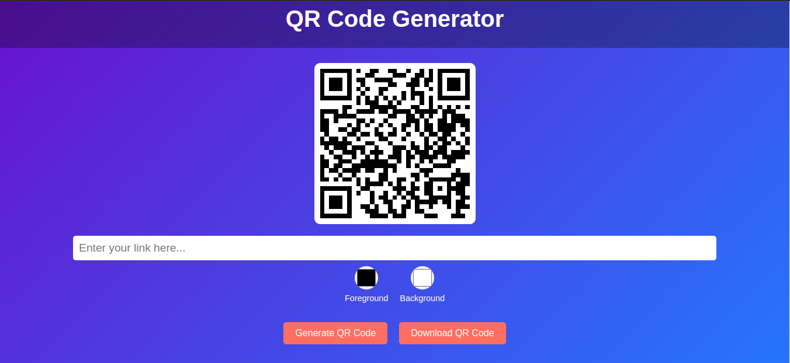

# Dynamic QR Code Generator

An elegant, customizable, and user-friendly **QR Code Generator** web app that allows users to create dynamic QR codes with features like custom colors, live previews, and the ability to download the generated QR code. Designed with a stunning UI/UX to ensure the best user experience!

---

## Features
- 🌐 **Default QR Code**: Automatically displays a QR code for the default URL `https://sharan.is-a.dev`.
- 🔗 **Dynamic Link Input**: Generate QR codes for any valid URL entered by the user.
- 🎨 **Customizable Colors**: Choose foreground and background colors with a fully circular color picker.
- 📥 **Save as Image**: Download the generated QR code as a PNG file with one click.
- 🚀 **Responsive Design**: Works seamlessly on desktops, tablets, and mobile devices.

---

## Screenshots
### Homepage


---

## Installation and Setup
Follow these steps to set up the project locally:

1. **Clone the repository:**
   ```bash
   git clone https://github.com/Vasoyasharan/dynamic-qr-code-generator.git
   cd dynamic-qr-code-generator

2. **Open the project in your browser:**
   - Simply open the `index.html` file in your preferred browser.

--- 

## How to Use

1. **Generate a QR Code:**

   - Enter a valid URL in the input box (e.g., `https://example.com)`.
   - Click the **"Generate QR Code"** button.

2. **Customize Colors:**

   - Use the circular color pickers to set your preferred foreground and background colors.
   - The QR code updates dynamically in real-time.

3. **Download the QR Code:**

   - Click the **"Download QR Code"** button to save the QR code as a PNG image.

---

## **Technologies Used:**

   - HTML5: For the structure of the webpage.
   - CSS3: For the modern and responsive styling.
   - JavaScript: For dynamic QR code generation and interactions.
   - QRCode.js: A lightweight library for generating QR codes.


---

## **Contribution**
### Contributions are always welcome! If you want to improve this project, please:

  1. Fork the repository.
  2. Create a new branch (git checkout -b feature-new-feature).
  3. Commit your changes (git commit -m "Add new feature").
  4. Push to the branch (git push origin feature-new-feature).
  5. Open a pull request.

---

## **Contact**

For any questions or feedback, feel free to reach out:

  - GitHub: Vasoyasharan
  - Portfolio: sharan.is-a.dev
